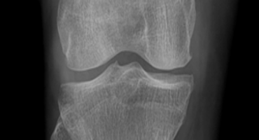
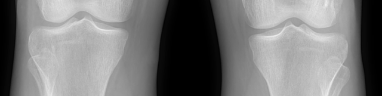
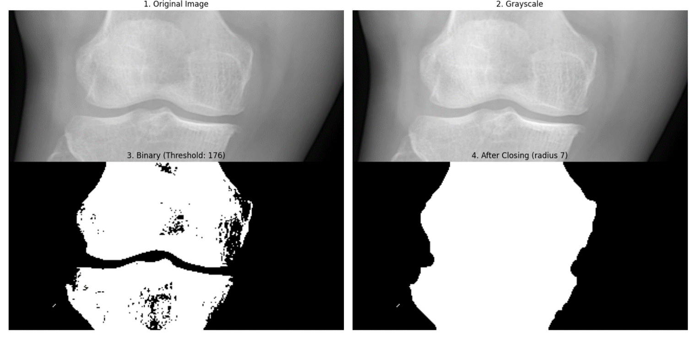
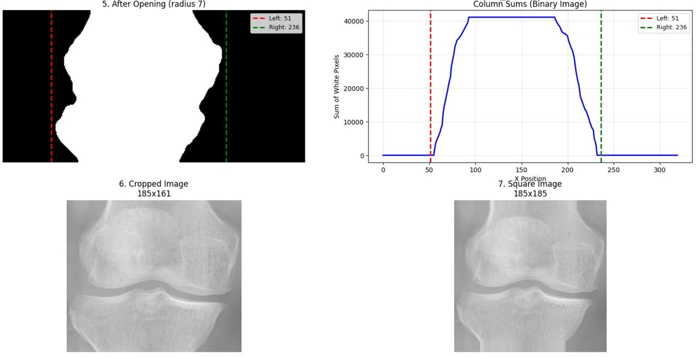
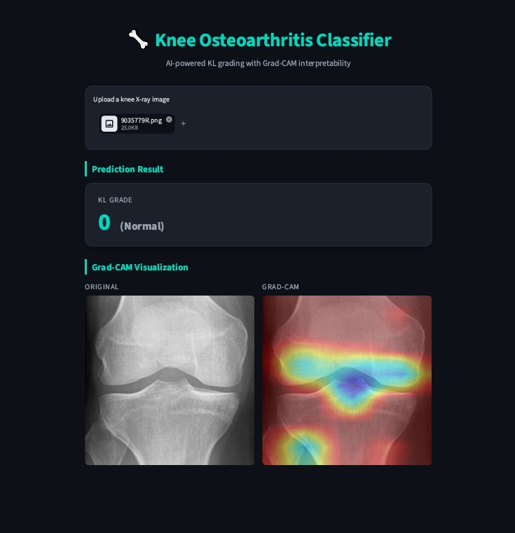
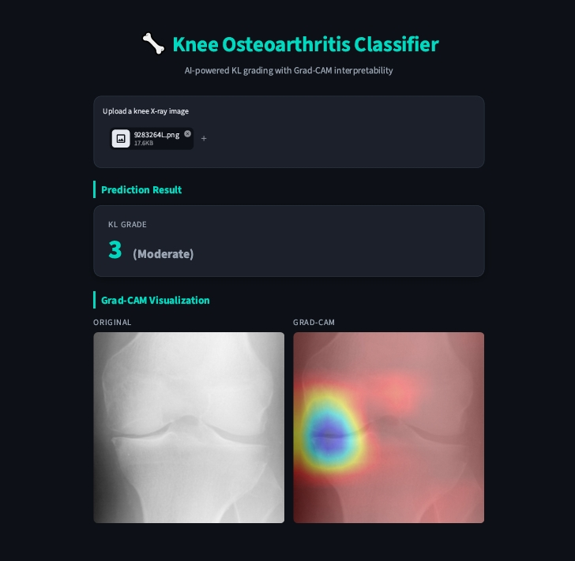
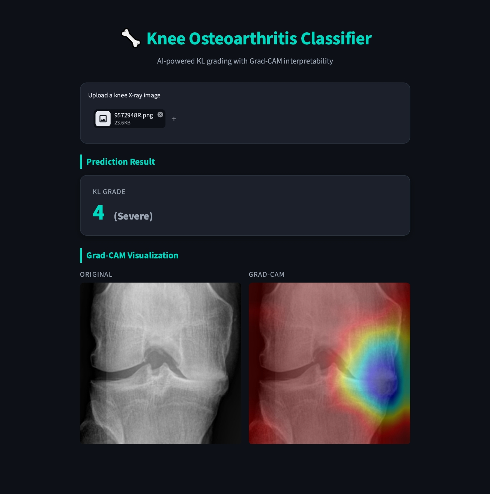

[**OPEN THE APP**](https://knee-osteoarthritis-classification-ghifar-khder.streamlit.app/)

# Knee Osteoarthritis Grading from X-ray Images

## Overview

This project implements an AI-based system for automatic Knee Osteoarthritis (KOA) severity grading from X-ray images, following the Kellgren-Lawrence (KL) scale (grades 0–4). A CNN classifier is trained on two complementary knee X-ray datasets, each preprocessed with a different pipeline to fit its own structure and limitations, and the final model is deployed as an interactive Streamlit app with Grad-CAM interpretability.

## Project Structure

```
├── .streamlit/                # Streamlit theme/config
├── .devcontainer/              # Dev container config
├── app.py                      # Streamlit app (inference + Grad-CAM)
├── final-model.keras           # Trained CNN model (Git LFS)
├── requirements.txt
└── README.md
```

## Datasets

Two datasets from Kaggle were used, each requiring a different preprocessing pipeline:

**1. Digital Knee X-ray dataset** — 1,650 images, 8-bit grayscale, labeled by two independent medical experts (two separate label sets). Grades: 0 Healthy (514), 1 Doubtful (477), 2 Minimal (232), 3 Moderate (221), 4 Severe (206). Non-uniform dimensions; some images contain **both knees in a single X-ray**.

<p align="center">
  
  
  <br>
  <em>Figure (1): An image that contains one knee vs. an image that contains both knees.</em>
</p>


**2. OAI (Osteoarthritis Initiative) dataset** — same grading task, but already preprocessed and pre-split (70% train / 10% val / 20% test). Main issue: significant class imbalance.

## Preprocessing

### Digital Knee X-ray dataset

1. **Splitting bilateral images into single-knee images** — Each image's width/height ratio is checked; images with `width/height > 2.5` are identified as containing both knees and split vertically down the center into two equal halves. The left half of the original image corresponds to the patient's **right** knee, and the right half to the patient's **left** knee. Images that don't meet this ratio are already single-knee and left untouched.

2. **Uniforming image dimensions to 224×224** — Each image is converted to grayscale and thresholded (≈60% of pixels below threshold) to get a binary mask, cleaned with morphological closing/opening (15×15 structuring element). The knee region's left/right boundaries are located by scanning the column-wise pixel-sum profile, the image is cropped to that region, padded (border replication) into a square, and resized to 224×224 — preserving the joint's structural ratio instead of a plain stretch/rescale.

<p align="center">
  <br>
  <em>Figure (2): Thresholding based on the condition ≈60% of pixels below threshold, with further preprocessing.</em>
</p>

<p align="center">
  <br>
  <em>Figure (3): Cropping the knee area and extending the length to get a square image.</em>
</p>

3. **Train/validation split** — 90% / 10% per class, done independently for each of the two expert-labeled sets, producing `train1/validation1` and `train2/validation2`.

### OAI dataset

Since this dataset was already clean and split, preprocessing focused on **fixing class imbalance** using a **Conditional DCGAN**: synthetic images are generated per class (14 / 1,254 / 784 / 1,543 / 2,127 for grades 0–4) to bring every class up to ~2,300 images, using a 100-dim latent vector, batches of 32, and a fixed random seed for reproducibility. Augmentation was applied to the training set only — validation and test sets were left untouched.

## Model

- CNN (ResNet-based) trained for 5-class KL grading on the combined, preprocessed datasets
- Grad-CAM used for visual interpretability (highlights the joint regions driving each prediction)

## Grad-CAM Examples

For a **Normal** (grade 0) knee, the Grad-CAM heatmap spreads across the entire joint space between the bones, since there is no localized damage for the model to focus on. For **Moderate** and **Severe** knees, the heatmap instead concentrates on the specific damaged or suspicious area of the joint — such as narrowed joint space or osteophytes — showing that the model is basing its grading on the actual pathological region rather than the joint as a whole.

<p align="center">
  <br>
  <em>Figure (4): Grade 0 (Normal) — Grad-CAM spread evenly across the joint space</em>
</p>

<p align="center">
  <br>
  <em>Figure (5): Grade 3 (Moderate) — Grad-CAM focused on the narrowed/damaged joint area</em>
</p>

<p align="center">
  <br>
  <em>Figure (6): Grade 4 (Severe) — Grad-CAM concentrated on the most affected region of the joint</em>
</p>


## App features

- Upload a knee X-ray image (JPG/PNG)
- Get the predicted KL grade (0–4)
- View a Grad-CAM heatmap overlaid on the original X-ray

## Disclaimer

This tool is for educational and research purposes only. It is **not** a medical device and must not be used for clinical diagnosis.

## Contact

* **Developer:** Ghifar Khder
* **Email:** ghifarkhder2000@gmail.com
* **LinkedIn:** [www.linkedin.com/in/ghifar-khder](https://www.linkedin.com/in/ghifar-khder)
* **Repository:** [github.com/Ghifar-Khder/knee-osteoarthritis-classification](https://github.com/Ghifar-Khder/knee-osteoarthritis-classification)
